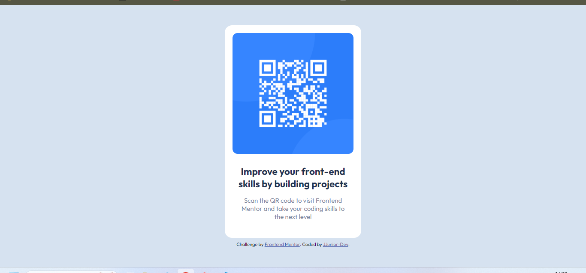

# Frontend Mentor - QR code component solution

This is a solution to the [QR code component challenge on Frontend Mentor](https://www.frontendmentor.io/challenges/qr-code-component-iux_sIO_H). Frontend Mentor challenges help you improve your coding skills by building realistic projects. 

## Table of contents

- [Overview](#overview)
  - [Screenshot](#screenshot)
  - [Links](#links)
- [My process](#my-process)
  - [Built with](#built-with)
  - [What I learned](#what-i-learned)
  - [Continued development](#continued-development)
  - [Useful resources](#useful-resources)
- [Author](#author)

## Overview

### Screenshot



### Links

- Solution URL: [Add solution URL here](https://your-solution-url.com)

## My process

### Built with

- Semantic HTML5 markup
- CSS custom properties
- Flexbox

### What I learned

As i did not know how to use "flex" property yet, it was hard work to finish this simple challenge. Stil learning.

```css
.display: flex
```

### Continued development

I am still not comfortable with "flexbox" property but i want to refine and perfect my knowledge.

### Useful resources

- [CSS Tricks](https://css-tricks.com/snippets/css/a-guide-to-flexbox/) - This helped me to understand a little bit more.I'd recommend it to anyone still learning this concept.

## Author

- Website - [GITHUB - JJunior-Dev](https://github.com/JJunior-Dev)
- Frontend Mentor - [@JJunior-Dev](https://www.frontendmentor.io/profile/JJunior-Dev)
